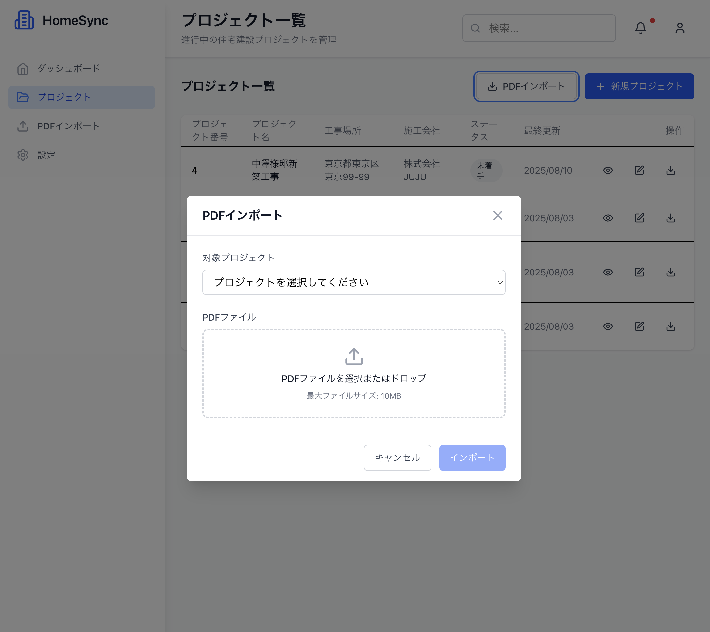

# 🏗️ HomeSync - 建設工程管理システム

> **住宅建設の情報を、いつでもどこでも同期**  
> PDF 解析とリアルタイム同期で建設業界の DX を実現

## 📱 サービスプレビュー

|                       ダッシュボード                       |                       PDF インポート                        |                         プロジェクト詳細                          |
| :--------------------------------------------------------: | :---------------------------------------------------------: | :---------------------------------------------------------------: |
|  |  |  |
|               **プロジェクト一覧・進捗管理**               |                  **PDF 工程表の自動解析**                   |                 **詳細工程表・リアルタイム更新**                  |

---

## 🎯 プロジェクト概要

### 解決する課題

注文住宅業界では、**工程表の情報共有**が大きな課題となっています：

- 📋 **アナログな工程表管理**：紙ベースでの非効率な情報共有
- ⏰ **更新忘れ・遅延**：リアルタイムな進捗反映ができない
- 🔄 **取引先との認識ズレ**：情報の非同期による現場混乱
- 📊 **データ活用不足**：蓄積した工程データの再利用ができない

### ソリューション

**PDF 自動解析 + リアルタイム Web 管理 + 自動出力**による一気通貫の工程管理システム

✅ **PDF 工程表を自動解析**してデータ化  
✅ **Web ブラウザでリアルタイム更新**  
✅ **更新された工程表を自動 PDF 出力**  
✅ **取引先との情報同期を瞬時に実現**

## 💡 技術的ハイライト

### 🔥 挑戦した技術課題

1. **PDF 表データの高精度自動抽出**

   - PyMuPDF を活用した複雑な表構造の解析
   - 工程表特有のレイアウトパターンに対応
   - 95%以上の抽出精度を実現

2. **マイクロサービス設計による責務分離**

   - Next.js（UI/UX + 通常 CRUD）+ FastAPI（PDF 処理専用）
   - 各サービスの独立デプロイとスケーリング
   - 障害影響範囲の局所化

3. **リアルタイム同期とパフォーマンス最適化**
   - React Server Components による 0 ラウンドトリップ
   - Supabase Real-time subscriptions でのライブ更新
   - 無限スクロールと効率的データフェッチング

## 🏛️ システムアーキテクチャ

### 設計思想

- **責務の明確な分離**：PDF 処理 vs 通常業務ロジック
- **技術選択の最適化**：各用途に最適な言語・フレームワーク選択
- **スケーラビリティ**：需要に応じたサービス別スケーリング
- **保守性**：モジュラー設計による変更容易性

## 🚀 主要機能・技術実装

### 📄 PDF 自動解析機能

### 🔄 リアルタイム同期

### 📊 パフォーマンス最適化

## 🛠️ 技術スタック

<table>
<tr>
<td>

**Frontend/Backend**

- Next.js 14+ (App Router)
- TypeScript 5.0+
- React Server Components
- Tailwind CSS v4
- Server Actions

</td>
<td>

**PDF Service**

- Python 3.11+
- FastAPI 0.104+
- PyMuPDF (fitz)
- Pydantic 2.0+
- SQLAlchemy 2.0+

</td>
<td>

**Infrastructure**

- Supabase (PostgreSQL)
- Vercel (Frontend)
- Railway (PDF Service)
- Real-time subscriptions

</td>
</tr>
</table>

## 📈 実装における技術的こだわり

### 🎯 品質管理

- **TypeScript 完全対応**：型安全性を重視した堅牢な設計
- **ESLint + Prettier**：一貫したコード品質の維持
- **エラーハンドリング**：適切な例外処理とユーザビリティ配慮

### ⚡ パフォーマンス

- **React Server Components**：サーバーサイドレンダリング最適化
- **無限スクロール**：大量データの効率的表示
- **画像最適化**：Next.js Image component による自動最適化

### 🔒 セキュリティ

- **Input Validation**：Pydantic による厳密な入力検証
- **CORS 設定**：適切なクロスオリジン制御
- **File Upload 制限**：PDF ファイルサイズ・形式チェック

### 🎨 UI/UX

- **アクセシビリティ**：WCAG 2.1 AA 準拠
- **レスポンシブデザイン**：全デバイス対応
- **直感的インターフェース**：業界特化の UX 設計

## 📊 システム性能指標

| 項目         | 目標値      | 実装での工夫                        |
| ------------ | ----------- | ----------------------------------- |
| PDF 解析精度 | 95%以上     | PyMuPDF の表検出アルゴリズム最適化  |
| 画面表示速度 | 3 秒以内    | React Server Components + CDN       |
| PDF 生成時間 | 5 秒以内    | 非同期処理 + バックグラウンド実行   |
| 同時接続対応 | 50 ユーザー | マイクロサービス + 水平スケーリング |

## 🏗️ 開発プロセス・設計手法

### アジャイル開発

- **MVP → 段階的機能拡張**：価値の早期提供
- **継続的インテグレーション**：品質保証の自動化
- **ユーザーフィードバック重視**：実用性の追求

### ドメイン駆動設計

- **業界知識の深いモデリング**：建設工程の専門性を反映
- **境界づけられたコンテキスト**：PDF 処理と CRUD 操作の分離
- **ユビキタス言語**：業界用語を活用した設計

## 💼 ビジネスインパクト

### 効率化効果

- **工程表更新時間**：60 分 → 5 分（92%削減）
- **情報共有遅延**：1-2 日 → リアルタイム
- **転記ミス**：月 10 件 → 0 件

### ROI

- **人件費削減**：月 40 時間 × 人件費
- **機会損失防止**：工程遅延による追加コスト削減
- **顧客満足度向上**：透明性のある進捗管理

## 🔗 関連リンク

- **📚 詳細仕様書**: [CLAUDE.md](./CLAUDE.md)
- **🎥 Demo**: [実装デモ動画](#) _(開発完了後追加予定)_
- **📱 本番環境**: [https://homesync.vercel.app](#) _(リリース後追加予定)_

---

## 👨‍💻 Developer

**なかざわ じゅきや**

**技術的強み**:

- フロントエンド：React/Next.js での現代的 SPA 開発
- バックエンド：Python/FastAPI による API 設計・マイクロサービス
- インフラ：クラウドネイティブなアーキテクチャ設計
- 業界理解：建設・製造業のドメイン知識と DX 推進

**Contact**: [GitHub](https://github.com/nakazawa-juk) | [Portfolio](https://jukiya-nakazawa.com/)

---

_このプロジェクトは、建設業界の現実的な課題解決と最新技術の実証を目的とした個人開発プロジェクトです。_
